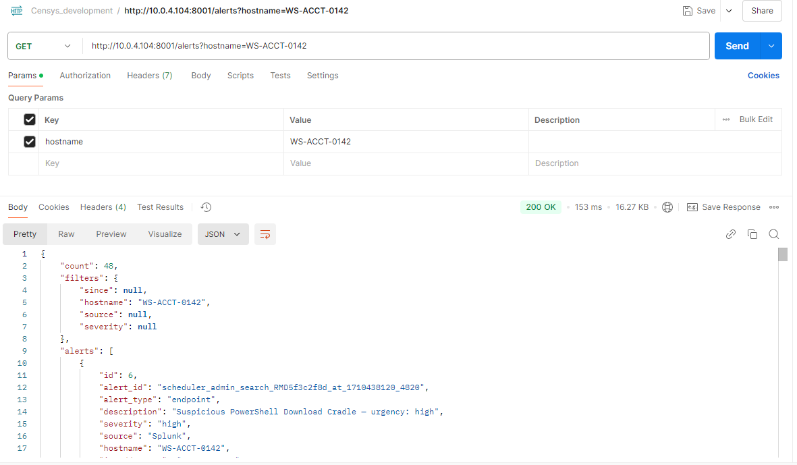
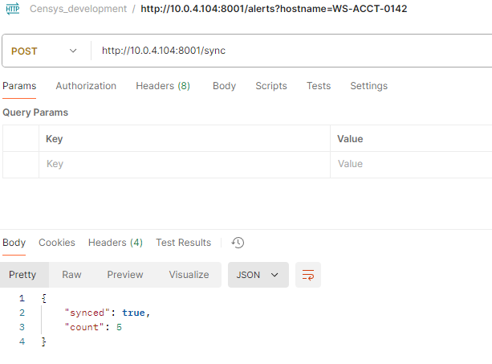
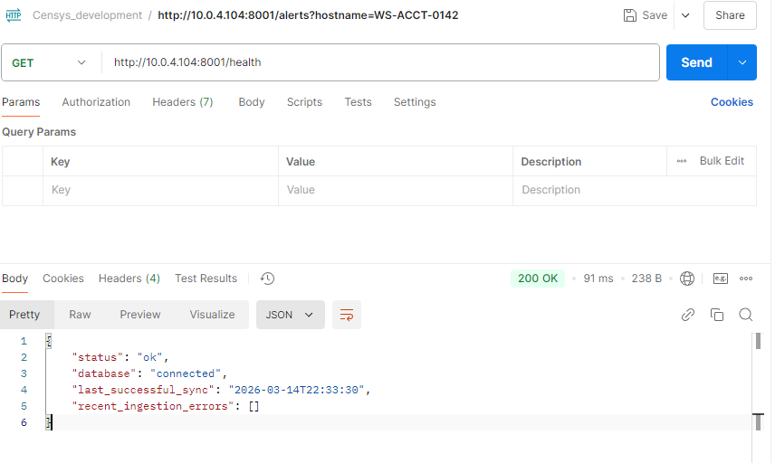
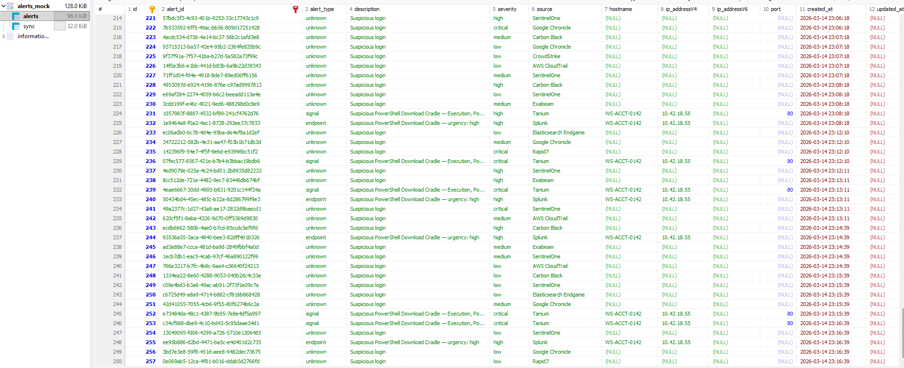

# censys-sectech-feed
An example for how a feed could pull from sectech, translate the data, and store the data in a standard schema for data-lake or other purposes.

## Three Project Approach
- The `alerts_api` folder contains the mock alerts from various security technology, 
- The `alerts_db` folder contains the database for the security technology alerts, as well as the database for translated, enriched, alert storage from the service.
- The `sectech_api` folder contains a service that looks up events/alerts from security technology it then translates them, enriches them, and stores that data in the db and/or returns that data to the end user.

## How to start
- This project runs in Docker to stand up the services and infrastructure needed to support the project.
- Build the containers:
  - run: `docker compose build`
- Start the services:
  - run: `docker compose up -d && docker compose logs -f`
- Use the following URLs to see the endpoints available for each API
  - alerts:  `http://(host):8000/docs`
  - service: `http://(host):8001/docs`

## Tests
- Start the containers/services with `docker compose up -d --build`
- execute the tests inside the container environment with:
  - `docker exec service_api pytest tests/ -v`

## Alerts API Service
- The alerts API is the mock upstream Alerts technology.
- The available endpoints are:
  - `/alerts` - this retursn the generic alert as provided in the assignment outline
  - `/api/v1/rapid7/search_assets` - this is an enrichment endpoint for rapid7 source alerts with asset/device details. part 1 of 2
  - `/api/v1/rapid7/search_alerts` - this is an enrichment endpoint for rapid7 source alerts with more alert details, part 2 of 2
  - `/api/v1/splunk/search_alerts` - this is an enrichment endpoint for splunk source alerts
  - `/api/v1/tanium/tanium_threat_response` - this is an enrichement endpoint for tanium source alerts, part 1 of 2
  - `/api/v1/tanium/get_alerts` - this is an enrichment endpoint for step 2 of tanium source alerts, part 2 of 2
- See more:  `http://(host):8000/docs`

## Service API Server
- This is the service we would run to gather alerts from upstream security technology.
- This runs at a cadence configurable in an environment variable, currently set to 1 min.
- This follows the workflow:
  - Sync interval hit, run sync
  - pull alerts from alerts api
  - for each alert with a splunk, tanium, or rapid7 source, enrich it with further api calls to their respective endpoints
  - store the alerts in the DB
  - store the sync run in the DB
  wait for next interval
- Service has these endpoints:
  - `/alerts` - returns a list of alerts with optional filtering on "since", "hostname", "source" and "severity"
  - `/sync` - forces a sync to run regardless of sync time interval
  - `/health` - returns the health of the service, database, errors, and last sync timestamp.

## Notable Call Outs
- The Translate helper is designed such that it can be resued with every vendor/security technology to normalize data into the schema for storing the alert into the DB.
  - `service_api/api/v1/utils/translate.py`
- The alerts api /alerts endpoint has a 10% chance of responding with a 429 to simulate upstream service errors.
- Api pathing.  I kept the required `/alerts` `/sync` and `/health`.  However you'll notice In my APIs I used a versioning approach of `/api/v1/(service)/(endpoint)`
- Database - I used Mysql here, as it is quick and easy for local development and testing, production environments could easily use postgres, spanner, or bigquery.  The rigidity of a relational database simulates an environment where other code projects using ORMs might be making use fo the alerts out by this service into the data.
  - If rigid conformity is not required, we can easily dump these enriched alerts into an Elasticsearch instance to datalake the data or run more aggregate type searches.

## AI Experience:
- I used Claude AI via the VSCode extension to write the majority of the code, I used prompts with simpe instructions and very clearly defined expectations, I also leaned on claude to help with troubleshooting, only a few times did I have to get into the logs and execute things to undersatnd a specific error and then address it.
- I used ChatGPT for research and information.  I got the sample outputs for the SecTech providers for rapid7, tanium, and Splunk from ChatGPT as it read their api docs and generated mock output.

### AI Issues:
- The Agent struggled with building out the containers in the docker compose the way I had designed them to work, it took some iterations and back and forth with the approach to get it settled into a working multi-container solution, but we got there.

## Conclusion
This project runs a simulated alerts API which responds with randomized alert details, it then has a service API which takes those alerts, and enriches the content for certain providers, storing the alert details in a normalized schema into a MySql Database.

## Examples
These are scnreeshots of the project working in it's various states:
- Alerts Example
  - 
- Sync Example:
  - 
- Health Example:
  - 
- Data Example:
  - 